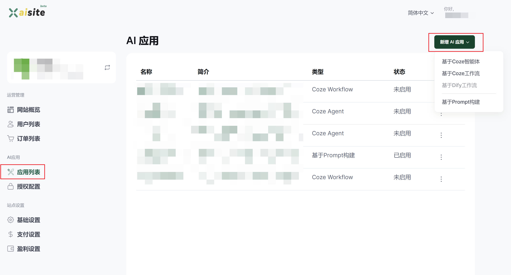
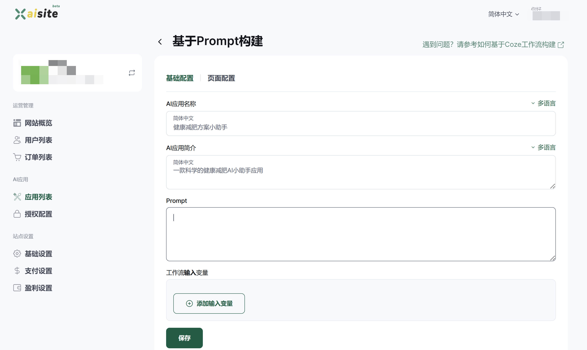
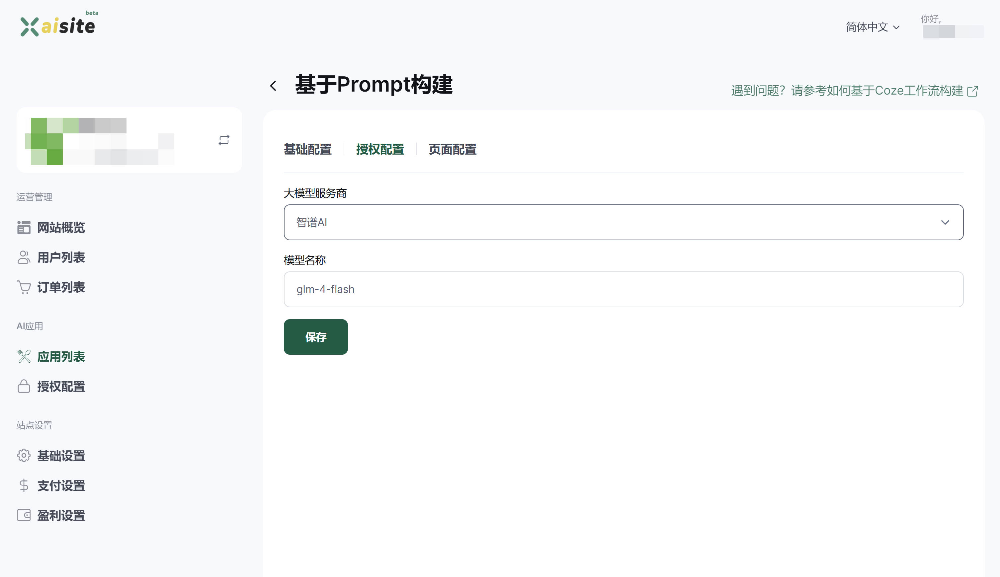
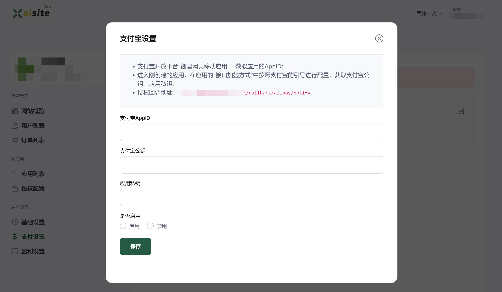
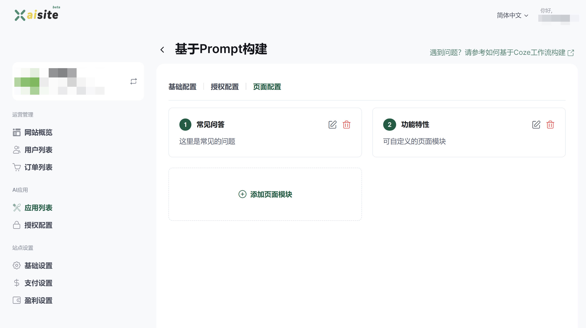

# 快速开始

> 为您的 AI 创意构建一个个性化的盈利网站，只需简单5步操作。

## 1、创建一个网站

打开[xaisite](https://xaisite.com/)网站，使用**邮箱登录**或者**Google账号授权登录**后，访问[运营中心](https://xaisite.com/creator/index)，如果未创建网站会自动跳转到创建网站界面：

设置`站点名称`与`站点默认语言`，站点默认语言一旦设置不可以更改，你可以根据面向用户人群需要，设置默认语言，更多详细设置请参考[站点语言设置]()。

## 2、添加一个AI应用

在[应用列表](https://xaisite.com/creator/agent/list)页面，点击右上方新增AI应用，选择一种最适合你的AI应用。

比如我选择**基于Prompt构建**：

基于Prompt方式构建的AI应用，必须配置对应的大语言模型支持，我们在**授权配置**页面中，选择已经授权的大语言模型，并指定对应的模型。

**保存并启用该AI应用**！ 

## 3、设置盈利模式与支付方式

XAI平台提供了多种盈利模式支持，包括订阅模式（推荐）、按量付费、Google广告，如果你不需要付费也可以设置免费模式。

进入[盈利设置](https://xaisite.com/creator/payments/profit_model)页面，设置对应的月订阅金额、年订阅金额以及收款的货币类型，如下图：

提醒：`设置为默认的盈利模式`启用才会开启哦。

设置盈利模式后，需要配置对应的收款方式(如果设置的是免费，就不需要配置收款方式。Google Ads与其他盈利模式是独立的，也就是其他盈利模式设置不影响Google Ads再次开启)：

## 4、完善网站信息

实际上，以上三步你已经完成了网站的基础搭建，也可以访问和体验对应的流程了。但是为能更好的服务好你的用户，你可以继续完善对应的网站信息。

### 4.1、绑定自定义域名

盈利性的网站需要[绑定自定义域名](https://xaisite.com/creator/settings/update_domain)，`XAI`会全程自动为你的域名提供SSL安全访问证书托管，您无需担心域名证书等问题。

### 4.2、为AI应用完善信息

您可以为单个AI应用完善其产品说明、FAQ等信息，不尽让用户更全面了解该AI应用，也能起到SEO的效果。

## 5、上线

分享并赚钱去吧，`XAI`在背后为您提供强大的技术支撑。