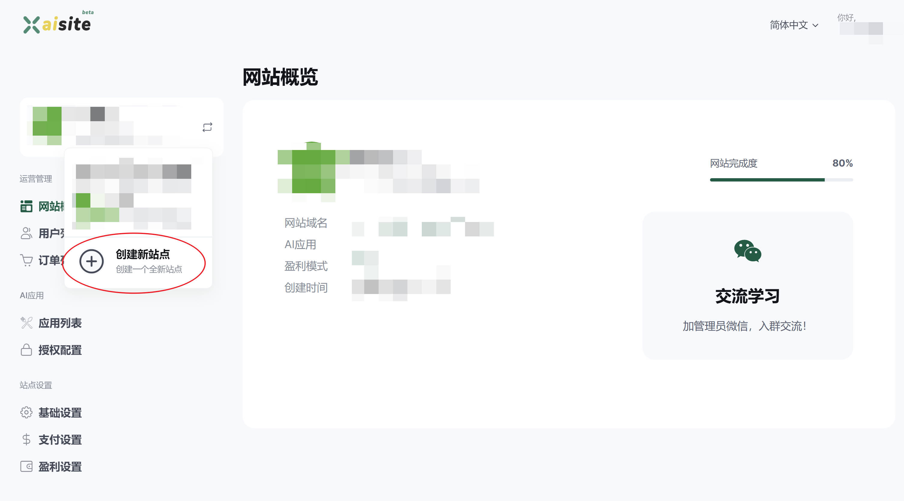
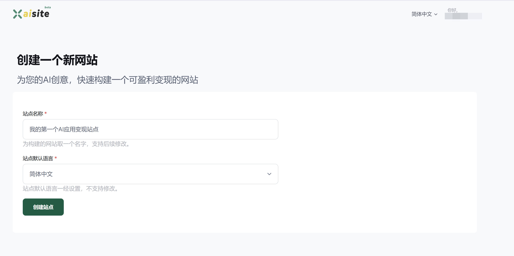

# 新增站点

当你登录账号后，你可以通过创建站点来承载你的AI应用。一个站点（网站）可以承载**1个或多个AI应用**。注意：

- **免费用户**最多可以创建1个站点
- 一个账号下最多可以创建20个站点

## 创建步骤

1. 登录[运营中心](https://xaisite.com/creator/index)，如果你之前没有站点，则会自动跳转到网站创建页面。否则请参考步骤2；

2. 点击左上角“**创建新站点**”或直接访问[https://xaisite.com/creator/new_website](https://xaisite.com/creator/new_website)，如下图：

   

3. 在站点创建页面，填写站点名称与站点默认语言

   

   站点名称可以后续修改，站点默认语言是指站点与访问用户的语言不一致时候，展示的默认语言，该选择一旦设置后续不可修改。

4. 点击“**创建站点**”完成网站创建。

## 友情提示
- 好的站点名称有利于SEO优化与用户记忆
- 默认语言优先选择你站点服务用户使用最多的语种
- **冒充平台、非法词汇（如提供色情、赌博、毒品交易、涉政）等，情节严重者会做封号处理**
