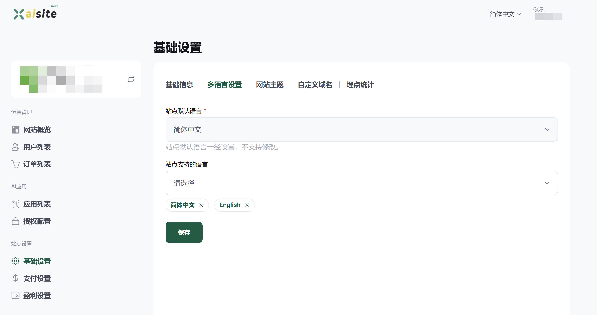

# 多语言设置
如果您的站点不需要多语言，请忽略本章节。

为了更好的服务全球用户，`XAI平台`提供了多语言支持，您可以为站点设置多种语言，并利用自带的`AI翻译功能`轻松进行内容本地化。

进入[多语言设置界面](https://xaisite.com/creator/settings/update_language_codes)：

为您的站点选择合适的语言支持，如果用户在你的网站切换语言的时候，未能找到对应的本地化语言文案，则会显示默认语言的文案。

## 友情提示
- 语言支持当然越多越好，但是越多的语言支持意味着需要为后续配置（校对）更多的本地化文案
- 如果你服务的人群，就是某种语言的用户，比如中国大陆用户，那么你只需要支持简体中文即可