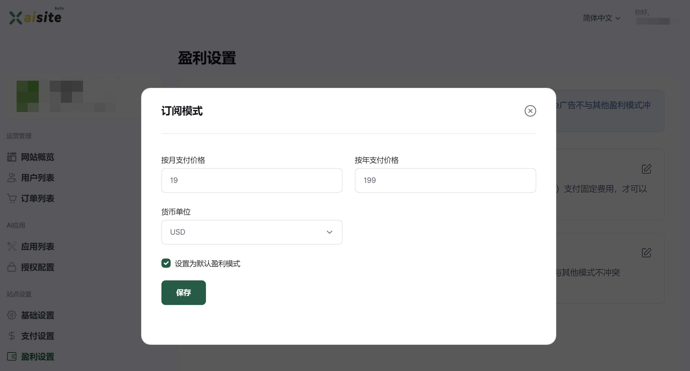
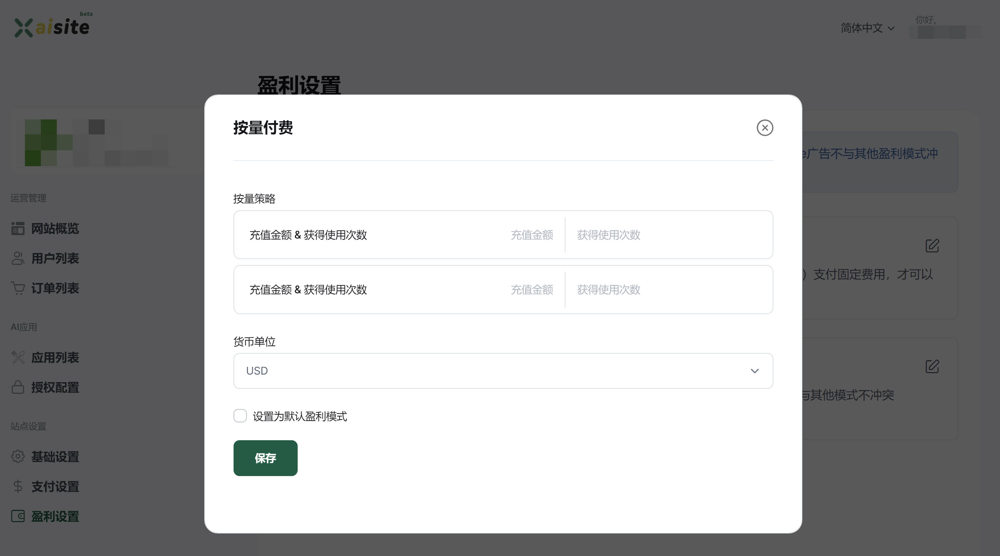
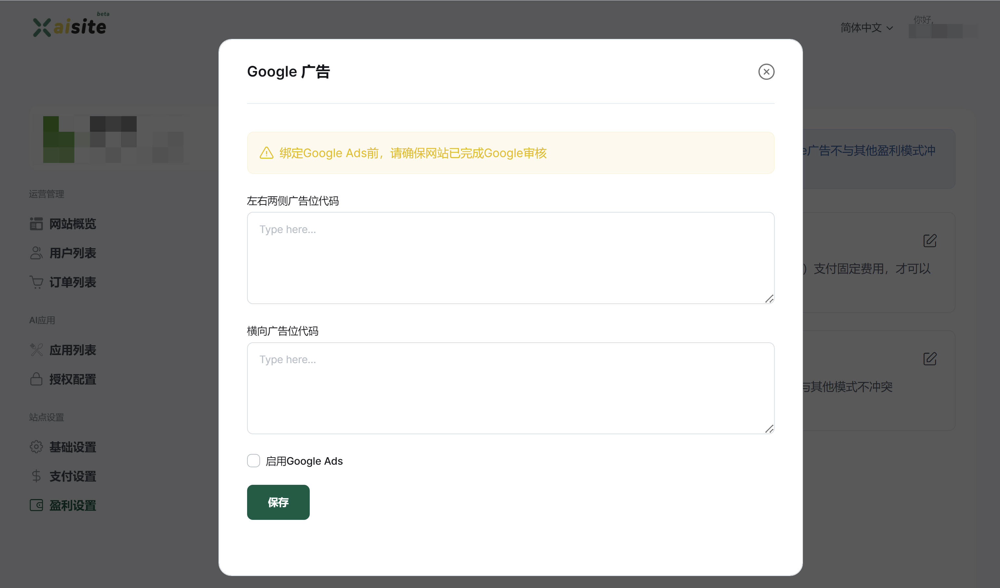

# 盈利模式设置

XAI平台提供了`3+1的盈利模式`，即**订阅模式**、**按量付费**、**免费**3种支付方案+1种**广告**方案的盈利模式。3种支付方案中只能选择其中1种，广告盈利模式与其他方案不冲突。

## 订阅模式（推荐）

订阅模式是一种定期收费的商业模式，用户通过支付固定费用获得在特定时期内使用产品或服务的权限。平台提供了两种订阅周期，即**按月订阅、按年订阅**，你**需要为不同订阅周期设置不同的订阅价格**，同时指定你收款的货币类型（此处需要与你配置的支付方式收款货币保持一致）。

我们建议站点通过订阅模式的方式进行盈利。

## 按量付费
按量付费模式是指用户根据实际使用量支付费用（开启该模式，每成功调用1次消耗1次使用量）。

你需要设置好用户每次充值金额以及对应获得的次数。

## 免费模式
无限制向用户开放，用户可以免费使用。适合一些企业定制的智能AI客服类系统采用该模式，也适合通过流量变现的AI站点（即Google Ads+免费模式配合）。

## Google 广告
平台目前接入了Google Ads广告平台，你可以为你的站点设置广告盈利模式，我们会根据页面呈现将广告自动投放到对应的页面位置。

# 友情提示

- 价格策略的设置，是一种智慧，需要综合考虑你的AI支出成本以及用户使用量来进行综合定价
- 免费的模型（比如智谱AI的文本与图像模型）非常适合免费模式+Google Ads的盈利方式