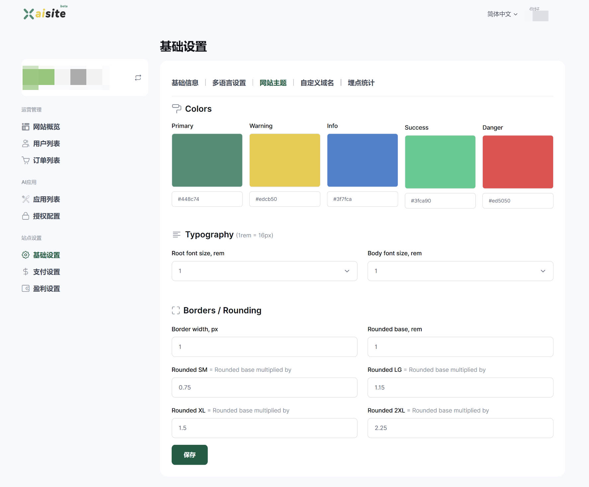

# 自定义主题

为了让您的AI应用站点更具有个性化以及与产品功能匹配，XAI平台提供了主题自定义的能力。

访问[网站主题自定义页面](https://xaisite.com/creator/settings/update_themes)：

我们提供了颜色方案、字体方案、边框圆角等自定义设置。

# 友情提示

网站是基于`Bootstrap 5`的响应式布局，请在自定义主题方案后，最好也检查一下在不同设备（如手机端）的呈现情况